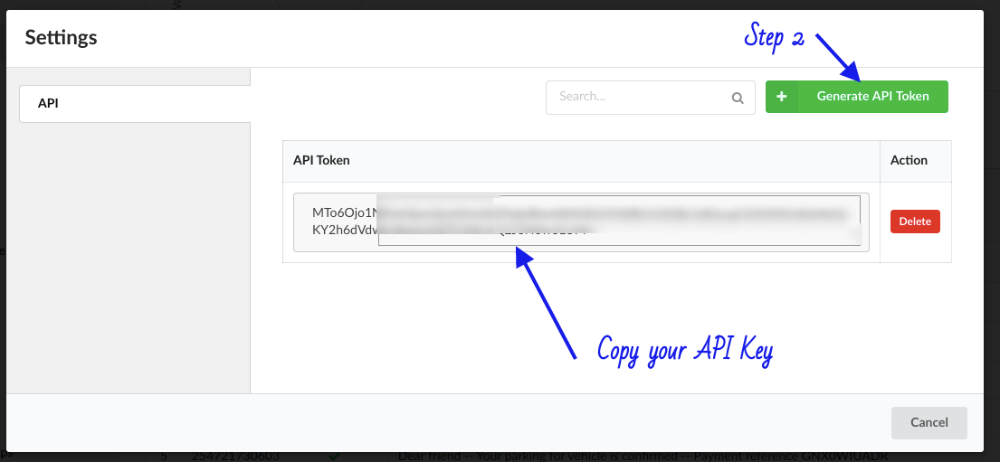

# Generate Token

Before you begin API integrations you will have to generate authorization token. Below steps are outlined on how to generate authorization token.
You need to create an account at [SMS Savvy](https://sms-savvy.co.ke). Once you have the account, login to your account 

### Step 1
Once logged in go to the bottom left red sidebar, look for cog wheel icon (show in the below image) and click it


### Step 2

Setting popup will show once you click the cog wheel icon. Click the API section then click generate API Token button. Shown in the below image. Once the API is generated it will be displayed in the same popup window. Copy the API Token and store it securely.



# Authentication headers

SMS Savvy SMS Portal uses API key to allow access to the API. You can register a new API key by logging in to your account and follow the above steps.
SMS Savvy SMS Portal expects API key to be included in all API requests to the server in a header that looks like the following:

`Authorization: secureapikeys`

<aside class="warning">
You must replace <code>secureapikeys</code> with your personal API key.
</aside>

# SMS APIs

## Send SMS
> Send sms endpoint expects JSON in the below format:

```json
{
    "message": "message here",
    "msisdn": "2547xxxxxxxx",
    "sender_id": "SMS Savvy"
}
```

```ruby
require 'net/http'
require 'uri'
require 'json'

uri = URI.parse("https://vas.sms-savvy.co.ke/api/message/send/sms")

header = {'Content-Type': 'text/json','Authorization':'secureapikeys'}
user = {
            message: 'message here',
            msisdn: '2547xxxxxxxx',
            sender_id: 'SMS Savvy'
       }

# Create the HTTP objects
http = Net::HTTP.new(uri.host, uri.port)
request = Net::HTTP::Post.new(uri.request_uri, header)
request.body = user.to_json

# Send the request
response = http.request(request)
```

```python

import requests

newHeaders = {'Content-type': 'application/json', 'Authorization': 'secureapikeys'}
payload = {'message': 'message here','msisdn':'2547xxxxxxxx','sender_id':'SMS Savvy'}

response = requests.post('https://vas.sms-savvy.co.ke/api/message/send/sms',data=payload,headers=newHeaders)

print("Status code: ", response.status_code)

response_Json = response.json()
print("Printing Post JSON data")
print(response_Json['status'])
print(response_Json['message'])

```

```shell
curl --location --request POST 'https://vas.sms-savvy.co.ke/api/message/send/sms' \
--header 'Content-Type: application/json' \
--header 'Authorization: secureapikeys' \
--data-raw '{
    "message": "You message",
    "msisdn": "2547xxxxxxxx",
    "sender_id": "SMS Savvy"
}'
```

```javascript

            // Creating a XHR object 
            let xhr = new XMLHttpRequest(); 
            let url = "https://vas.sms-savvy.co.ke/api/message/send/sms"; 

            // open a connection 
            xhr.open("POST", url, true); 
 
            // Set the request header i.e. which type of content you are sending 
            xhr.setRequestHeader("Content-Type","application/json"); 
            xhr.setRequestHeader("Authorization","secureapikeys"); 
 
            // Create a state change callback 
            xhr.onreadystatechange = function () { 
                if (xhr.readyState === 4 ) { 
  
                    // Print received data from server 
                    console.log(this.responseText.status); 
                    console.log(this.responseText.message); 
                } 
            }; 
            
            var message = {
                "message": "message here",
                "msisdn": "2547xxxxxxxx",
                "sender_id": "SMS Savvy"
            }
  
            // Converting JSON data to string 
            var data = JSON.stringify(message); 
  
            // Sending data with the request 
            xhr.send(data); 
```

```go
package main

import (
  "bytes"
  "fmt"
  "net/http"
  "io/ioutil"
  "encoding/json"
)

func main() {

  url := "http://vas.sms-savvy.co.ke/api/message/send/sms"
  method := "POST"

// construct your message using interface
 message := map[string] interface{}{
    "message": "You message",
    "msisdn":"2547xxxxxxxx",
    "sender_id":"SMS Savvy",
 }

 // convert to json
  payload,err := json.Marshal(message)
  if err != nil {

    fmt.Println(err)
  }

// make http request
  client := &http.Client {}
  req, err := http.NewRequest(method, url, bytes.NewBuffer(payload))

  if err != nil {

    fmt.Println(err)
  }

  req.Header.Add("Content-Type", "application/json")
  req.Header.Add("Authorization", "secureapikeys")

  res, err := client.Do(req)
  if err != nil {

    fmt.Println(err)
  }	
	
  defer res.Body.Close()
  body, err := ioutil.ReadAll(res.Body)

  fmt.Println(string(body))
}
```

```java
import java.io.BufferedReader;
import java.io.IOException;
import java.io.InputStreamReader;
import java.io.OutputStream;
import java.net.HttpURLConnection;
import java.net.URL;
import com.google.gson.Gson;

public class PostJSONWithHttpURLConnection {
	
	public static void main (String []args) throws IOException{

		URL url = new URL ("https://vas.sms-savvy.co.ke/api/message/send/sms");
		
		HttpURLConnection con = (HttpURLConnection)url.openConnection();
		con.setRequestMethod("POST");
		
		con.setRequestProperty("Content-Type", "application/json; utf-8");
		con.setRequestProperty("Accept", "application/json");
		con.setRequestProperty("Authorization", "secureapikeys");
		
		con.setDoOutput(true);
		
		//JSON String need to be constructed for the specific resource. 
		Map<String, String> map = new LinkedHashMap<>();
        map.put("message","You message");
 	    map.put("msisdn","2547xxxxxxxx");
 	    map.put("sender_id","SMS Savvy");
        Gson gson = new Gson();
        String jsonInputString = gson.toJson(map);
		
		try(OutputStream os = con.getOutputStream()){
		
			byte[] input = jsonInputString.getBytes("utf-8");
			os.write(input, 0, input.length);			
		}

		int code = con.getResponseCode();
		System.out.println(code);
		
		try(BufferedReader br = new BufferedReader(new InputStreamReader(con.getInputStream(), "utf-8"))){
			StringBuilder response = new StringBuilder();
			String responseLine = null;
			while ((responseLine = br.readLine()) != null) {
				response.append(responseLine.trim());
			}
			System.out.println(response.toString());
		}
	}

}
```

```php

<?php
    $message = [
        "message" => 'You message',
        "msisdn" => "2547xxxxxxxx",
        "sender_id" => "SMS Savvy"        
    ];
    
    $data_string = json_encode($message);

    $httpRequest = curl_init("https://vas.sms-savvy.co.ke/api/message/send/sms");
    curl_setopt($httpRequest,CURLOPT_POST,true);
    curl_setopt($httpRequest,CURLOPT_POSTFIELDS,$data_string);
    curl_setopt($httpRequest,CURLOPT_TIMEOUT,60);
    curl_setopt($httpRequest,CURLOPT_RETURNTRANSFER,1);
    curl_setopt($httpRequest,CURLOPT_HTTPHEADER,array(
        "Content-Type:application/json",
        "Authorization: 'secureapikeys'"
        )
    );
    curl_setopt($httpRequest,CURLOPT_RETURNTRANSFER,true);
    //curl_setopt($httpRequest,CURLOPT_HEADER,1);

    $response    = curl_exec($httpRequest);
    $status      = curl_getinfo($httpRequest,CURLINFO_HTTP_CODE);
    curl_close($httpRequest);
    echo $status;
    echo $response;
           
```

> The above command returns JSON structured like this on success:

```json
{
    "message": "SMS successfully queued for sending. Total recipients 1",
    "status": 200,
    "transaction_id": 2295
}
```
> On failure the following is returned, refere to status codes for error types

```json
{
    "status": 428,
    "message": "error message"
}
```

This endpoint retrieves all kittens.

### HTTP Request

`POST https://vas.sms-savvy.co.ke/api/message/send/sms`

### Query Input Parameters
The API expects a JSON payload with the following

Key | Required| Default | Description
--------- | -------- | ------- | -----------
message | yes | none | message ro send
msisdn | yes | true | Recipient phone number. Separate multiple numbers with comma ( , )
country_code | no | ke | if this is not a kenya number, supply the country code
sender_id | no | SMSSavvy | your registered sender ID

## Send Bulk SMS

```ruby
require 'kittn'

api = Kittn::APIClient.authorize!('meowmeowmeow')
api.kittens.get(2)
```

```python
import kittn

api = kittn.authorize('meowmeowmeow')
api.kittens.get(2)
```

```shell
curl "http://example.com/api/kittens/2"
  -H "Authorization: meowmeowmeow"
```

```javascript
const kittn = require('kittn');

let api = kittn.authorize('meowmeowmeow');
let max = api.kittens.get(2);
```

> The above command returns JSON structured like this:

```json
{
  "id": 2,
  "name": "Max",
  "breed": "unknown",
  "fluffiness": 5,
  "cuteness": 10
}
```

This endpoint provides an interface to upload contacts in a file. 

### file format
You can only upload a CSV file
The first row will in the file will be treated as headers. 

#### basic format

The first column is expected to be the phone numbers example below

msisdn |
-------------- |
2547xxxxxxx0 |
2547xxxxxxx1 |
2547xxxxxxx2 |
2547xxxxxxx3 |
2547xxxxxxx4 |

#### custom messages
File upload API allows you to send custom sms e.g when sending school fees balance where you want to customize sms for every contact to pick the required fee balance. 

1. step 1  
create file with allow values to be replace. 
When creating a file in this category, the 1st column remains to be phone number, the subsequent columns will be the replacement parameters. example you want to send sms to parents your want sms to go out with student name, fee balance and adminission number. Your file will have the below format

msisdn | name | admission | balance |
-------------- |-------------- |-------------- |-------------- |
2547xxxxxxx0 |John Doe | adm/01 | 1000
2547xxxxxxx1 |Alice Bobby | adm/02 | 1000
2547xxxxxxx2 |Ruby Rose | adm/03 | 1000
2547xxxxxxx3 |George Nim | adm/04 | 1000
2547xxxxxxx4 |Lucas Madona | adm/05 | 1000
 

You can have as many columns and rows the only limit will be file size, your file should be below 100MB

2. step 2
Compose your sms to include column header name wrapped in square brackets `[ and ]` example to use *name* in SMS we use `[name]` back to our example above our sms will look like the following

`Dear parent your student [name] has a fee balance of [balance]. Please pay your fees through paybill 89544 account [admission] thank you` 

The above will be your sms contents, the system will go through the file row by row replacing SMS parameters with values in the file in that column. Each recipient will receive a customized SMS

### HTTP Request

`POST https://vas.sms-savvy.co.ke/api/message/send/bulk`

### URL Parameters

This endpoint accepts form data with the below fields

Key | Required| Default | Description
--------- | -------- | ------- | -----------
message | yes | none | message ro send
country_code | no | ke | if this are not a kenya phone numbers, supply the country code
sender_id | no | SMS Savvy | your registered sender ID
file | yes | File to be uploaded
campaign_name | yes | Name of Campaign, contact group
